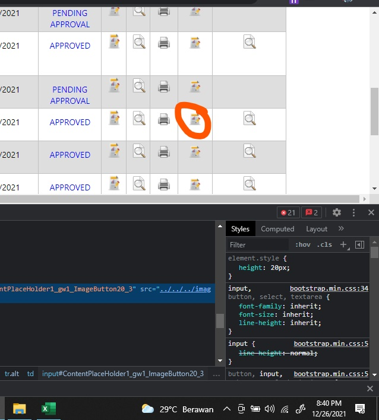

## About UUM Merit Form Filler
UUM Merit Form Filler is a web automation which helps automate entering a matric number to the UUM system in order for participants to obtain a merit score.

The reason why this code exists because i was involved in a GDSC UUM tech workshop which had a total of 355 participants. At first, i tried to enter it manually but it was too tedious. Then, i researched on how to automate it and boom I figured it out and it works.

## How to use

- have python installed
- open terminal
- then run this in your terminal `pip install -r requirements.txt`
- add your attendance.csv which can be converted from excel file with the following format `MATRIC NO,NAME` e.g 123123, ilham *note: at the moment it only accepts .csv extension
- create .env file and add your credentials `USERNAME='your_uum_username' PASSWORD='your_uum_password'`
- next, you only need to configure the main.py file. choose which project report activity you want to choose. replace the ContentPlaceHolder1_gw1_ImageButton20_4 with your own report_activity_btn_id.

- in order to find the id of an element, you have to inspect element of your page by pressing `ctrl+shift+c` or simply right click and choose inspect. Then, point to the report button you want to choose.


- 
- 
- you will see the id of the button. Next, simply replace the ContentPlaceHolder1_gw1_ImageButton20_4 in run_flow main.py with your own button id like the following example
```
    run_flow(username,password,'attendance.csv','ContentPlaceHolder1_gw1_ImageButton20_4')


```

- finally, run your code with `python main.py`
