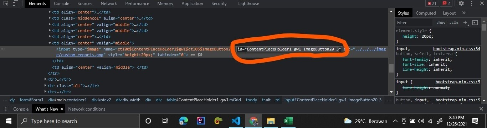

## About UUM Merit Form Filler

UUM Merit Form Filler is a web automation which helps automate entering a matric number to the UUM system in order for participants to obtain a merit score.

The reason why this code exists because i was involved in a GDSC UUM tech workshop which had a total of 355 participants. At first, i tried to enter it manually but it was too tedious. Then, i researched on how to automate it and boom I figured it out and it works.

## How to use
```
    run_flow('your_uum_username','your_uum_password','location_csv',page number,'project report id')

```
- download this script by going to green button that says 'code' and download it as ZIP
- then extract it
- make sure you have python installed
- open terminal like cmd in the extracted ZIP
- then run this in your terminal `pip install -r requirements.txt`
- prepare your attendance.csv which can be converted from excel file with the following format `MATRIC NO,NAME` e.g 123123, ilham or simply just matric number only \*note: at the moment it only accepts .csv extension
  
- put the attandance.csv file in the same directory of this project

- next, you only need to configure the main.py file.
- choose the number page where the project report is located for example 2.
- choose which project report activity you want to choose. replace the ContentPlaceHolder1_gw1_ImageButton20_4 with your own report_activity_btn_id.

- in order to find the id of an element, you have to inspect element of your page by pressing `ctrl+shift+c` or simply right click and choose inspect. Then, point to the report button you want to choose.

- 
- 
- you will see the id of the button. Next, simply replace the ContentPlaceHolder1_gw1_ImageButton20_4 in run_flow main.py with your own button id like the following example
- then pass in your attendance.csv path
- example: 
  ```
    run_flow('my_username','my_password','attendance.csv',2,'ContentPlaceHolder1_gw1_ImageButton20_1')

  ```

- finally, run your code with `python main.py`
